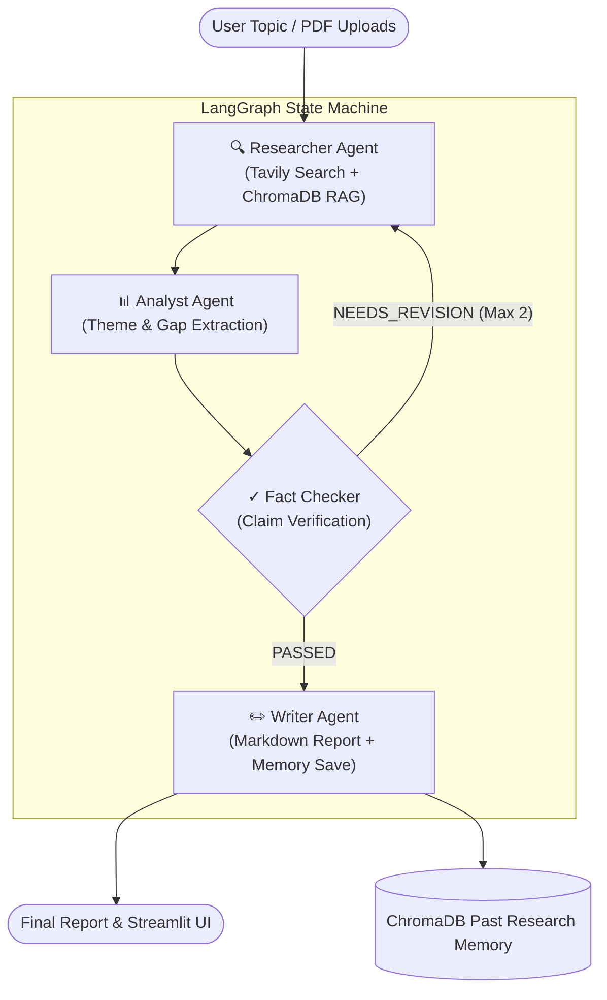

# 🔬 Multi-Agent Research Orchestrator

[](https://www.python.org/downloads/)
[](https://github.com/langchain-ai/langgraph)
[](https://groq.com/)
[](https://www.trychroma.com/)
[](https://streamlit.io/)
[](https://github.com/jlowin/fastmcp)

An autonomous, self-correcting multi-agent research pipeline that collaborates to research complex topics, analyze contradictions, verify claims, and produce publication-ready Markdown reports with citations.

---

## 🌟 Key Features

- **🤖 4 Specialized AI Agents:**
  - **🔍 Researcher**: Generates multi-angle queries, searches the web via Tavily, and pulls context from uploaded PDFs via ChromaDB RAG.
  - **📊 Analyst**: Synthesizes raw findings into key themes, flags source contradictions, highlights consensus points, and identifies knowledge gaps.
  - **✓ Fact Checker**: Validates claims against source evidence. Triggers automatic revision loops if claims lack proof.
  - **✏️ Writer**: Compiles structured Markdown reports with citations and automatically saves session context into long-term vector memory.

- **🔄 Self-Correcting Revision Loop:**
  - If the Fact Checker flags unverified claims or gaps, the pipeline routes back to the Researcher with targeted feedback (up to 2 revision cycles).

- **📄 RAG & PDF Ingestion:**
  - Upload PDF research papers or documents to enrich agent knowledge using `sentence-transformers/all-MiniLM-L6-v2` embeddings in ChromaDB.

- **🧠 Persistent Research Memory:**
  - Past research reports are saved back into ChromaDB vector memory and automatically referenced in future research sessions.

- **🎨 Clean Human-Engineered UI:**
  - Custom Streamlit frontend featuring real-time agent execution streaming, activity logs, download buttons (`.md` / `.txt`), and **3 Appearance Themes** (`☀️ Light`, `🌙 Dark`, `🌲 Emerald Slate`).

- **🔌 FastMCP Server Interface:**
  - Exposes the entire orchestrator pipeline as MCP tools for **Claude Desktop**, **Cursor**, or any MCP-compliant AI assistant.

---

## 📐 System Architecture



---

## 📁 Repository Structure

```
Multi-Agent-Research-Orchestrator/
├── agents/
│   ├── researcher.py       # Query generation, Tavily search & RAG retrieval
│   ├── analyst.py          # Thematic analysis, gaps & contradictions
│   ├── fact_checker.py     # Claim verification & revision loop control
│   └── writer.py           # Markdown report synthesis & memory persistence
├── config/
│   └── setting.py          # Centralized configuration & environment loader
├── graph/
│   └── workflow.py         # LangGraph state graph assembly & conditional routing
├── rag/
│   └── vector_store.py     # ChromaDB persistence, PDF loading & similarity search
├── state/
│   └── schema.py           # Shared ResearchState TypedDict definition
├── app.py                  # Streamlit web application interface
├── mcp_server.py           # FastMCP server exposing tools for Claude Desktop / Cursor
├── requirements.txt        # Python package dependencies
├── .env.example            # Environment variable template
└── README.md               # Documentation
```

---

## 🚀 Quickstart Guide

### 1. Prerequisites & Installation

Clone the repository and install dependencies:

```bash
git clone https://github.com/YOUR_USERNAME/multi-agent-research-orchestrator.git
cd multi-agent-research-orchestrator

# Create & activate virtual environment
python -m venv .venv
# On Windows PowerShell:
.\.venv\Scripts\Activate.ps1
# On Linux/macOS:
source .venv/bin/activate

# Install required packages
pip install -r requirements.txt
```

---

### 2. Configure Environment Variables

Create a `.env` file in the root directory:

```env
GROQ_API_KEY=your_groq_api_key_here
TAVILY_API_KEY=your_tavily_api_key_here

MODEL_NAME=llama-3.3-70b-versatile
MAX_SEARCH_RESULTS=5
MAX_REVISIONS=2

CHROMA_PERSIST_DIR=./chroma_db
EMBEDDING_MODEL=sentence-transformers/all-MiniLM-L6-v2
CHUNK_SIZE=1000
CHUNK_OVERLAP=200
```

> 🔑 Get your API keys:
> - **Groq API Key**: [console.groq.com](https://console.groq.com/)
> - **Tavily API Key**: [tavily.com](https://tavily.com/)

---

### 3. Run the Web Application

Launch the Streamlit interface:

```bash
streamlit run app.py
```

Open your browser at `http://localhost:8501`.

---

### 4. Run as an MCP Server (Claude Desktop / Cursor)

Expose the orchestrator to AI assistants via Model Context Protocol:

```bash
python mcp_server.py
```

To connect to **Claude Desktop**, add this to your `claude_desktop_config.json`:

```json
{
  "mcpServers": {
    "research-orchestrator": {
      "command": "python",
      "args": ["/path/to/multi-agent-research-orchestrator/mcp_server.py"],
      "env": {
        "GROQ_API_KEY": "your_groq_api_key",
        "TAVILY_API_KEY": "your_tavily_api_key"
      }
    }
  }
}
```

---

## 🌐 Free Deployment (Streamlit Community Cloud)

1. Push this repository to **GitHub**.
2. Visit [share.streamlit.io](https://share.streamlit.io/) and click **New App**.
3. Select your repository, set main file to `app.py`.
4. Go to **Advanced settings $\rightarrow$ Secrets** and add your `GROQ_API_KEY` and `TAVILY_API_KEY`.
5. Click **Deploy!**

---

## 📜 License

MIT License — feel free to modify, extend, and use in your own AI projects!
