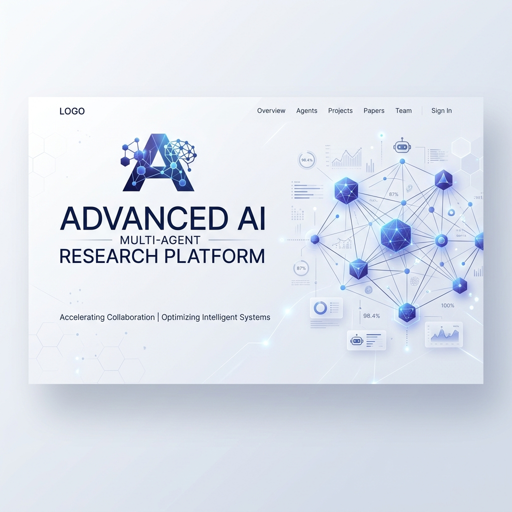
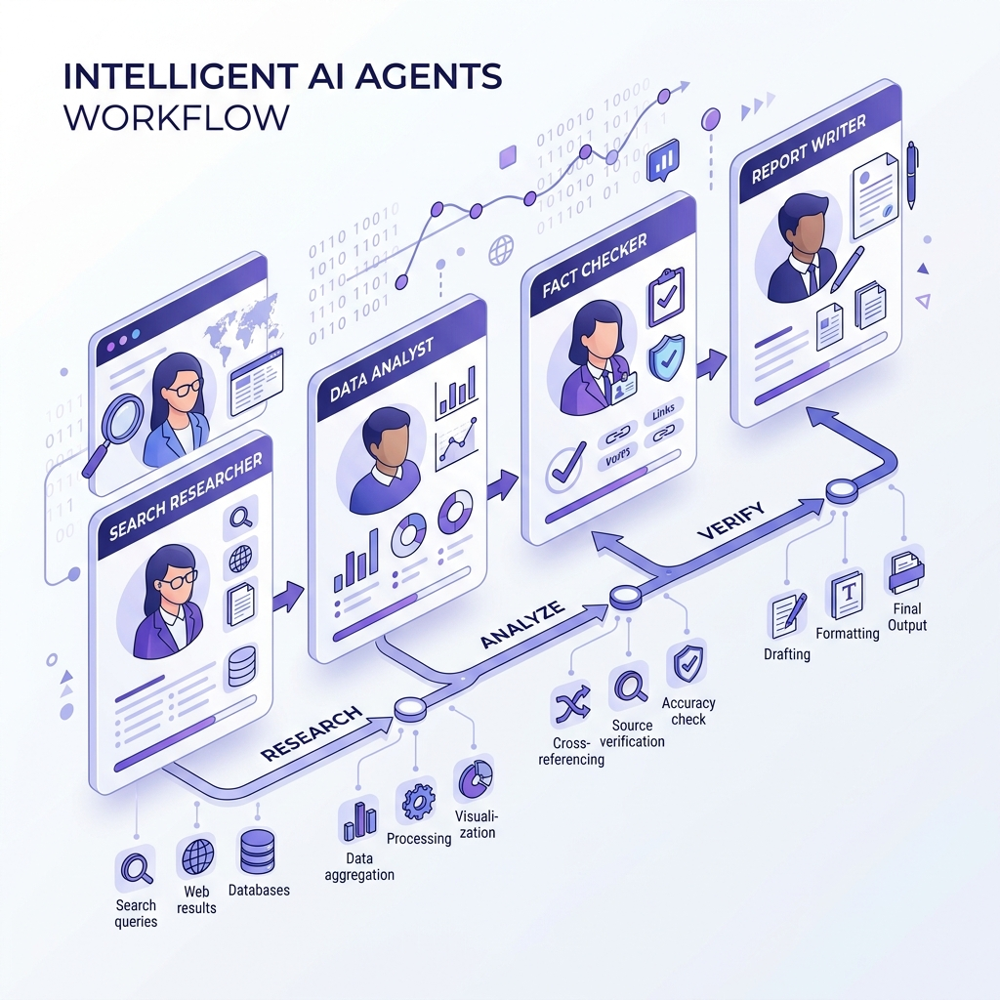
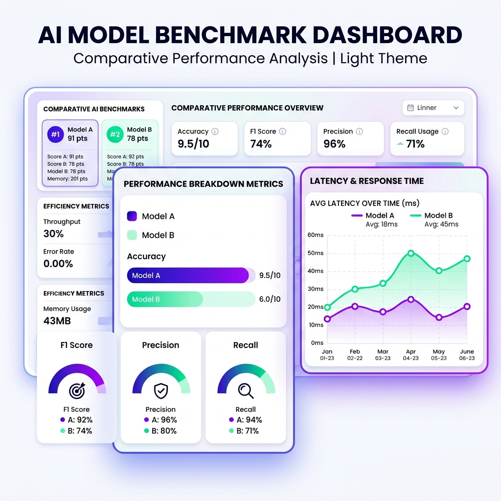

<div align="center">

# 🔬 Multi-Agent Research Orchestrator

### *Auth-First Production Platform for Autonomous AI Research & LLM Quality Benchmarking*

[](https://python.org)
[](https://www.django-rest-framework.org/)
[](https://langchain-ai.github.io/langgraph/)
[](https://groq.com)
[](https://streamlit.io)
[](https://www.docker.com/)

---



**Multi-Agent Research Orchestrator** is a full-stack, enterprise-grade AI research workspace powered by **LangGraph**, **Django REST Framework (Port 8080)**, and **Streamlit**. It coordinates a team of 4 specialized AI agents working alongside a persistent ChromaDB RAG engine to deliver fact-checked, fully cited research reports with live side-by-side quality benchmarks.

[Quick Start](#-quick-start) · [Architecture](#-architecture) · [Django REST API](#-django-rest-api) · [Benchmark Suite](#-llm-quality-benchmark-suite) · [Docker Deployment](#-docker--production-deployment)

</div>

---

## ✨ Key Platform Features

| Feature | Description |
|---|---|
| 🔐 **Auth-First Gateway** | Mandatory user login/signup gateway integrated with DRF Token Authentication. |
| 🔬 **Multi-Agent Pipeline** | 4 autonomous agents (Researcher, Analyst, Fact-Checker, Writer) in a state machine flow. |
| 📊 **LLM Quality Benchmark** | Side-by-side comparative evaluation of Single-Agent LLM vs Multi-Agent Orchestrator. |
| 📜 **User Research History** | Live user-isolated database history table tracking past reports and evaluation metrics. |
| 📚 **PDF RAG Vector Engine** | Upload PDF documents to ingest knowledge into persistent ChromaDB collections. |
| ⚡ **Fast Search Strategy** | Generates strategic sub-queries and executes non-blocking parallel Tavily searches. |
| 🔄 **Automated Verification Loop** | Fact-checker cross-verifies claims against sources with feedback cycles (max 2 loops). |
| 🎨 **Pristine White Light Theme** | High-contrast visual design, custom AI banners, and live agent status tracking. |
| 🐳 **Docker Containerized** | Full multi-container Docker Compose setup for backend API and Streamlit UI. |
| 🔌 **FastMCP Integration** | Exposed as a standard MCP Server for Claude Desktop, Cursor, and IDE extensions. |

---

## 🏗️ Architecture & Agent Pipeline



### Workflow Pipeline
```
                              ┌────────────────────────┐
                              │    User Input Query    │
                              └───────────┬────────────┘
                                          │
                                          ▼
                              ┌────────────────────────┐
                              │      🔍 Researcher      │◄────────────────────────┐
                              └───────────┬────────────┘                         │
                                          │ (Web Search + ChromaDB RAG)           │
                                          ▼                                      │
                              ┌────────────────────────┐                         │
                              │       📊 Analyst        │                         │
                              └───────────┬────────────┘                         │
                                          │ (Pattern & Consensus Extraction)     │
                                          ▼                                      │
                              ┌────────────────────────┐                         │ (Re-Research Loop
                              │     ✅ Fact Checker    ├─────────────────────────┘  Max 2 Loops)
                              └───────────┬────────────┘
                                          │ (Claims Verified)
                                          ▼
                              ┌────────────────────────┐
                              │        ✍️ Writer       │
                              └───────────┬────────────┘
                                          │
                                          ▼
                              ┌────────────────────────┐
                              │ Final Cited Markdown   │
                              └────────────────────────┘
```

- **Researcher Agent**: Formulates queries, performs parallel Tavily searches, and retrieves context from ChromaDB RAG.
- **Analyst Agent**: Identifies consensus, key themes, and contradictions across research data.
- **Fact-Checker Agent**: Evaluates claim credibility and routes back for additional research if gaps exist.
- **Writer Agent**: Synthesizes structured markdown reports complete with inline citations and references.

---

## 🔌 Django REST API (`/api/v1/`)

The platform includes a dedicated **Django REST API** running on **Port 8080** for database state management and token authentication.



### API Endpoints Overview

```
POST /api/v1/auth/register/     👉 Register new user account & receive Token
POST /api/v1/auth/login/        👉 Authenticate user credentials & return Token
GET  /api/v1/auth/me/           👉 Fetch authenticated user profile & task metrics
POST /api/v1/research/start/    👉 Trigger multi-agent research pipeline task
GET  /api/v1/research/history/  👉 List user-isolated past research tasks
POST /api/v1/eval/run/          👉 Execute single-agent vs multi-agent quality benchmark
GET  /api/v1/eval/history/       👉 Fetch historical benchmark evaluation logs
```

---

## 📊 LLM Quality Benchmark Suite

The platform includes an automated evaluation engine (`evaluation/evaluator.py`) that benchmarks research performance across key metrics:

1. **Conciseness & Precision Score** (0–100%)
2. **Fact Verification Rate** (% of claims backed by verified sources)
3. **Citation Density** (Citations per 1,000 words)
4. **Execution Duration** (Seconds elapsed)

---

## 🛠️ Tech Stack

- **Backend API**: Python 3.11, Django 5.1, Django REST Framework, SQLite / PostgreSQL
- **Orchestration**: LangGraph, LangChain, Groq API (`llama-3.3-70b-versatile`), Tavily Web Search API
- **RAG & Vectors**: ChromaDB, HuggingFace Embeddings (`all-MiniLM-L6-v2`), PyPDF / LangChain Document Loaders
- **Frontend UI**: Streamlit (Pristine Light Theme, Custom CSS Glassmorphism)
- **Deployment**: Docker, Docker Compose, FastMCP Server Protocol

---

## 🚀 Quick Start

### 1. Clone the Repository

```bash
git clone https://github.com/priyanshu967025/multi-agent-research-orchestrator-.git
cd multi-agent-research-orchestrator-
```

### 2. Set Up Virtual Environment

```bash
python -m venv venv
# On Windows:
venv\Scripts\activate
# On macOS/Linux:
source venv/bin/activate
```

### 3. Install Dependencies

```bash
pip install -r requirements.txt
```

### 4. Configure Environment Keys (`.env`)

```bash
cp .env.example .env
```

Edit `.env` and set your API keys:
```env
GROQ_API_KEY=gsk_your_groq_api_key
TAVILY_API_KEY=tvly-your_tavily_api_key
DJANGO_SECRET_KEY=your_django_secret_key
DJANGO_API_URL=http://127.0.0.1:8080/api/v1
```

### 5. Launch the Platform

#### Step A: Run Django REST API Server (Terminal 1)
```bash
python django_backend/manage.py migrate
python django_backend/manage.py runserver 8080
```

#### Step B: Run Streamlit UI (Terminal 2)
```bash
streamlit run app.py
```

Open **`http://localhost:8501`** to access the workspace!

---

## 🐳 Docker & Production Deployment

The project is pre-configured for Docker hosting:

```bash
# Build and run containers in background
docker-compose up --build -d
```

For cloud hosting instructions (Render / Railway / Streamlit Cloud), refer to [DEPLOYMENT.md](DEPLOYMENT.md).

---

## 📁 Repository Structure

```
Multi-Agent Research Orchestrator/
│
├── agents/                  # 🤖 Agent definitions (Researcher, Analyst, Fact Checker, Writer)
├── assets/                  # 🎨 Custom AI visual banners and diagrams
├── config/                  # ⚙️ Application configuration & env loader
├── django_backend/          # 🐍 Django REST API (Port 8080) for Auth & State Persistence
│   ├── api/                 # DRF Models, Views, Serializers, URLs
│   └── test_port_8080.py    # Dedicated API endpoint verification script
├── evaluation/              # 📊 LLM quality benchmarking engine
├── graph/                   # 🔗 LangGraph StateGraph state-machine wiring
├── notes/                   # 📑 LaTeX & documentation notes
├── rag/                     # 📚 ChromaDB vector engine & document loader
├── state/                   # 📐 Shared TypedDict state schemas
├── app.py                   # 🎨 Streamlit UI Workspace (Light Canvas Theme)
├── mcp_server.py            # 🔌 FastMCP server protocol
├── Dockerfile.backend       # 🐳 Django API Docker image definition
├── Dockerfile.frontend      # 🐳 Streamlit UI Docker image definition
├── docker-compose.yml       # 🐳 Multi-container production orchestrator
├── DEPLOYMENT.md            # 📖 Complete production deployment guide
└── README.md                # 📖 Platform Documentation
```

---

<div align="center">
  <sub>Built with ❤️ using LangGraph + Django REST + Groq + Tavily + ChromaDB + Streamlit</sub>
</div>
ase chunk counts |
| `clear_knowledge_base()` | Wipe all stored data |

---

## 🤝 Contributing

Contributions welcome! Feel free to open issues or submit PRs.

---

## 📜 License

MIT License — feel free to use this in your portfolio!

---

<div align="center">
  <sub>Built with ❤️ using LangGraph + Groq + Tavily + ChromaDB + FastMCP + Streamlit</sub>
</div>
